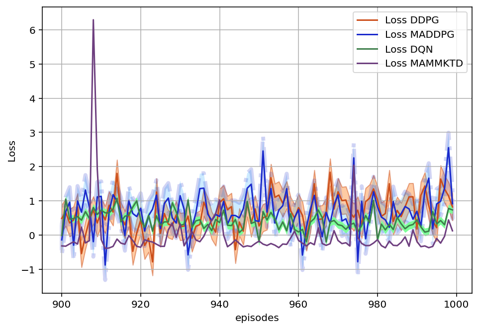
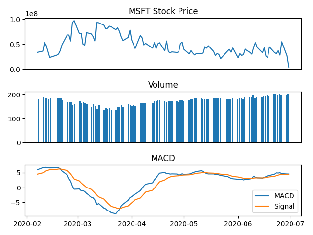

# GoWebFull
A project to go through the fundamentals of the web programming in GO. Specifically a guidance to work with Golang importanr librarise like storm and Gorilla.

# README # 
 
This README would normally document the project provided here. In this project, in addition to data gathering techniques, 
the process of financial analysis in stock market and cryptocurrency network will be analyzed. 
Moreover, Reinforcement Learning (RL) approaches are used to make a market portfolio manager engine. 
 

 
 
### What is this repository for? ### 
 
* Data Gathering - Financial Data Scrapping - Using APIs to gather the data - Working on Request, Beautiful Soup, Selenium and other web scraping techniques. 
* Financial Data Analysis 
* Key Financial Performance Indicators MACD, OBV, ADX, Renko Chart, RSI, Slope and the known indicaors 
* Key Financial Performance Measurement Metrics including: Sharpe Ratio, Sortino Ratio, CAGR and Volatility 
* Work on Financial BackTesting and Value Investing 
* Data analysis, and bot developement 
* RL approaches portfolio manager engine 
* [Learn More about us](https://bituniex.com/) 
 
 
### Materials Covered Here ### 
- [About the Project](#About-the-Project) 
- [About Data Gathering](#About-Data-Gathering) 
- [Financial Performance Indicators and Measurement](#Financial-Performance-Indicators-and-Measurement) 
 
## About The Project 
The main focus of this project is to represent an engine based on AI solutions to maximize the returned benefit in trading the stocks in the market. At the first steps, we focus on the financial data gathering capabilities and also the Key Financial Performance Indicators and Measurements. The backtesting techniques is deployed in the other part of the project and symply a trading bot is developed as a proof of the concept. 
An RL-based trading bot is developed and will be released soon. 

 

